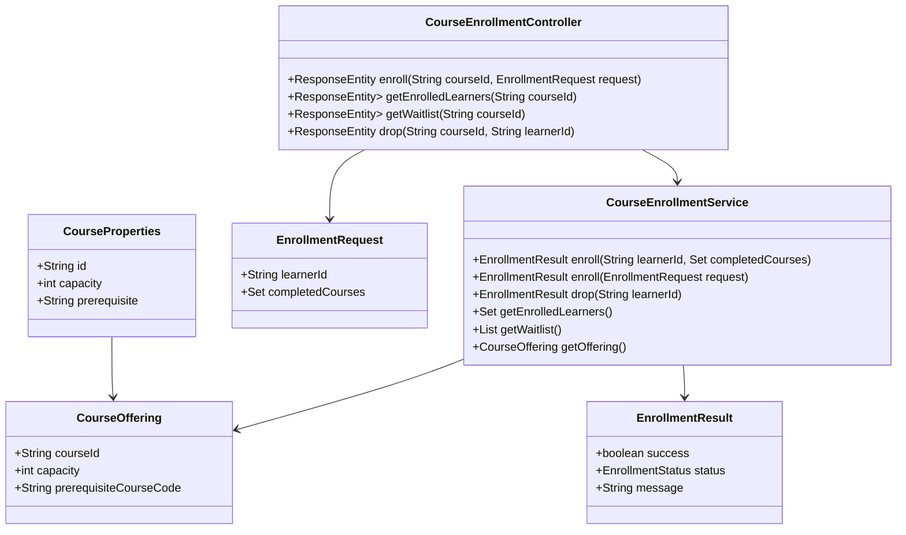
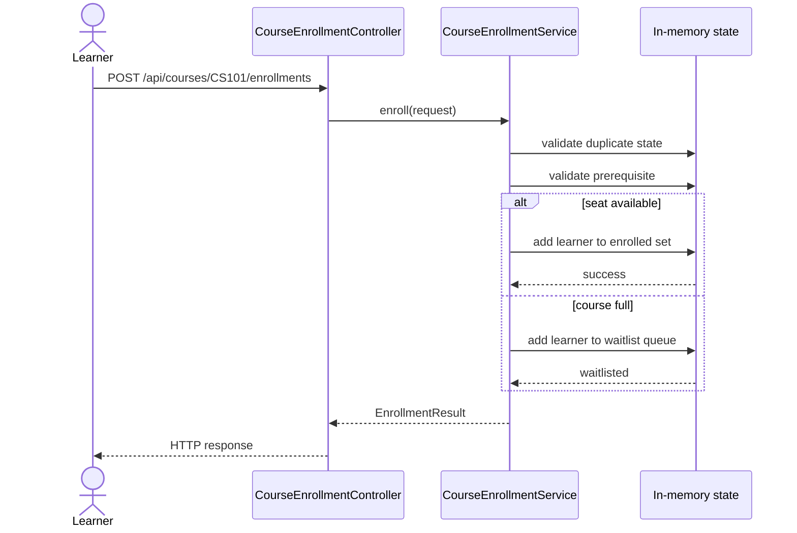
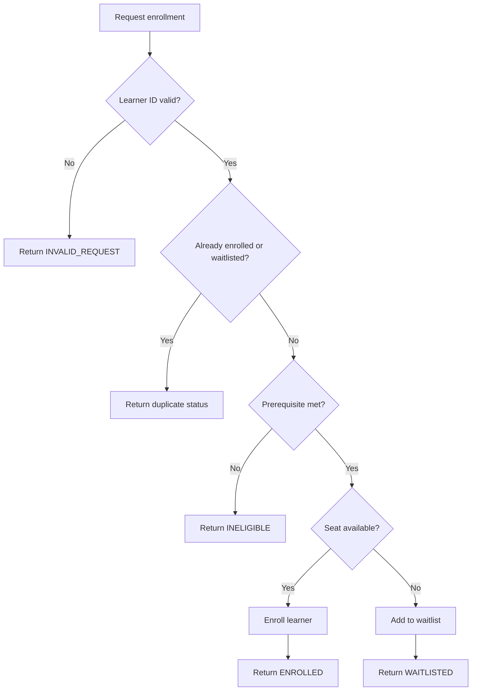

# UML Diagrams

## Class diagram

```mermaid
classDiagram
    class CourseOffering {
        +String courseId
        +int capacity
        +String prerequisiteCourseCode
    }

    class CourseEnrollmentService {
        +EnrollmentResult enroll(String learnerId, Set<String> completedCourses)
        +EnrollmentResult enroll(EnrollmentRequest request)
        +EnrollmentResult drop(String learnerId)
        +Set<String> getEnrolledLearners()
        +List<String> getWaitlist()
        +CourseOffering getOffering()
    }

    class EnrollmentResult {
        +boolean success
        +EnrollmentStatus status
        +String message
    }

    class EnrollmentRequest {
        +String learnerId
        +Set<String> completedCourses
    }

    class CourseEnrollmentController {
        +ResponseEntity<EnrollmentResult> enroll(String courseId, EnrollmentRequest request)
        +ResponseEntity<Set<String>> getEnrolledLearners(String courseId)
        +ResponseEntity<List<String>> getWaitlist(String courseId)
        +ResponseEntity<EnrollmentResult> drop(String courseId, String learnerId)
    }

    class CourseProperties {
        +String id
        +int capacity
        +String prerequisite
    }

    CourseEnrollmentController --> CourseEnrollmentService
    CourseEnrollmentService --> CourseOffering
    CourseEnrollmentService --> EnrollmentResult
    CourseEnrollmentController --> EnrollmentRequest
    CourseProperties --> CourseOffering
```

## Sequence diagram

```mermaid
sequenceDiagram
    actor Learner
    participant Controller as CourseEnrollmentController
    participant Service as CourseEnrollmentService
    participant Store as In-memory state

    Learner->>Controller: POST /api/courses/CS101/enrollments
    Controller->>Service: enroll(request)
    Service->>Store: validate duplicate state
    Service->>Store: validate prerequisite
    alt seat available
        Service->>Store: add learner to enrolled set
        Store-->>Service: success
    else course full
        Service->>Store: add learner to waitlist queue
        Store-->>Service: waitlisted
    end
    Service-->>Controller: EnrollmentResult
    Controller-->>Learner: HTTP response
```

## Activity diagram

```mermaid
flowchart TD
    A[Request enrollment] --> B{Learner ID valid?}
    B -- No --> C[Return INVALID_REQUEST]
    B -- Yes --> D{Already enrolled or waitlisted?}
    D -- Yes --> E[Return duplicate status]
    D -- No --> F{Prerequisite met?}
    F -- No --> G[Return INELIGIBLE]
    F -- Yes --> H{Seat available?}
    H -- Yes --> I[Enroll learner]
    H -- No --> J[Add to waitlist]
    I --> K[Return ENROLLED]
    J --> L[Return WAITLISTED]
```
